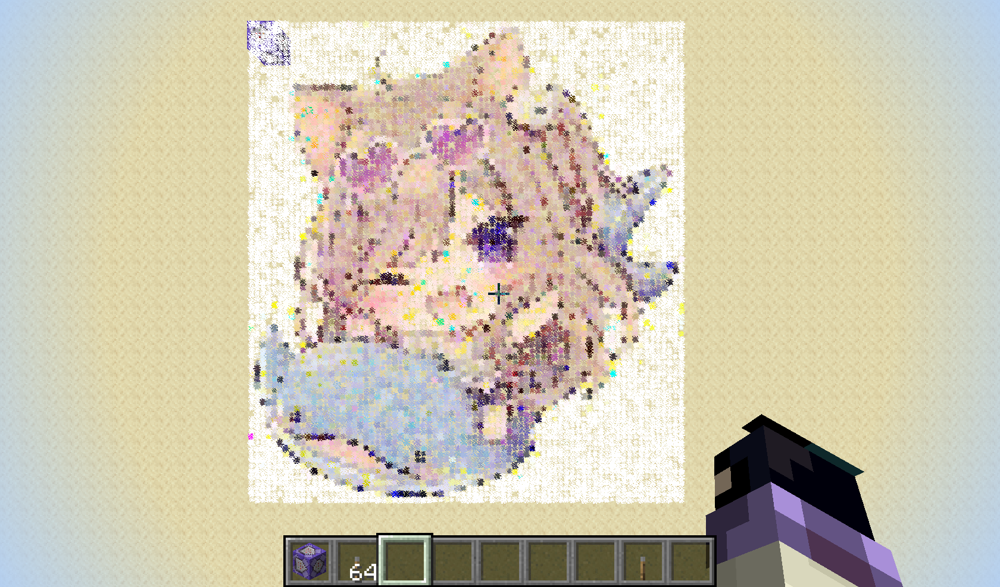
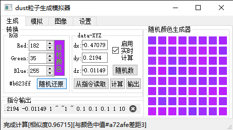
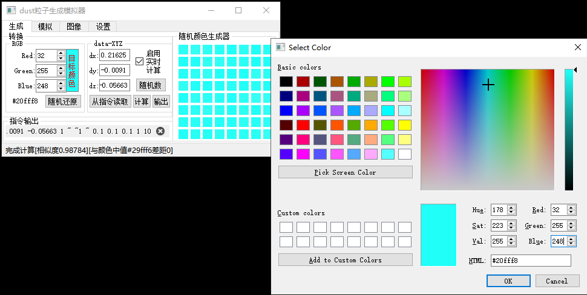
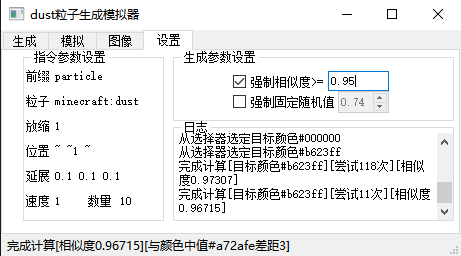

# minecraft_tools  
Some useful(?) Minecraft Tools  
compile with Python 3.6.5  
Used for some batch calculation  
一些有用(?)的我的世界小工具  
在python3.6.5环境下成功编译  
可用于一些批量计算  
不定期(有灵感的时候)更新  
有什么想法也可以[bilibili](https://space.bilibili.com/36838280)私信我  
  
## [warp2dimension.py](./warp2dimension.py)  
用于在20w14infinite下/warp <str>指令计算字符串所指向的最终目标维度  
##### 注1：输出的维度Int值为玩家标签Dimension数据值(即如果你想通过修改playerdata下玩家数据达到指定维度时应修改的Dimension值)，游戏内部(\_generated\:\<Int\>)值与保存的维度文件("\./world/DIM\<Int\>\")均为输出的维度Int+1  
##### 注2:有一些维度名称（例如“america”和“missingo”）会由于Java中的“Bound must be positive”异常而导致错误和崩溃，或者可能会使游戏假死，只能将其强制关闭。(内容摘抄自[wiki-20w14infinite](https://minecraft-zh.gamepedia.com/20w14infinite))，但是这并不是由于无法计算出相应的维度数据。而是由于目标维度区块生成的错误(例如"/warp america"后能够生成对应的DIM532766445文件，但是对应region的minecraft anvil文件缺是损坏的)有兴趣可以研究一下,文件已上传到[data/DIM532766445/r.0.0.mca](./data/DIM532766445/r.0.0.mca)  
  
## [particle-dust-ui.py](./particle-dust-ui.py)  
~~暴力破解就是天~~  

DUST粒子的颜色模拟器，通过随机的算法（因为原版就是随机计算，貌似没有什么捷径可图..或许是我才疏学浅了）计算和目标颜色最接近的粒子颜色生成指令，其中[APIparticle_dustONLY.py](./APIparticle_dustONLY.py)为粒子计算提供支持（包括正向解析和反向解析），[particle_ui_pyuic.py](./particle_ui_pyuic.py)是我粗略的写了一个基于PyQt5的UI  

  
